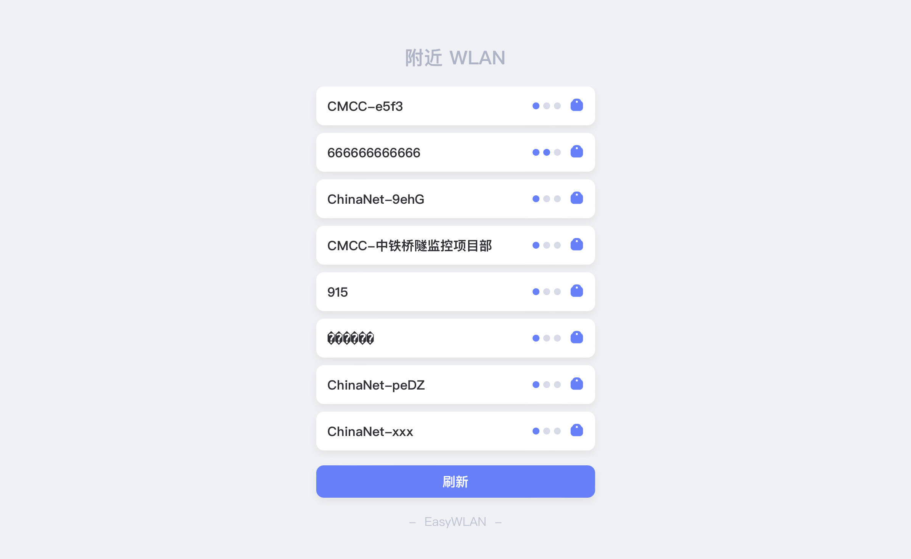
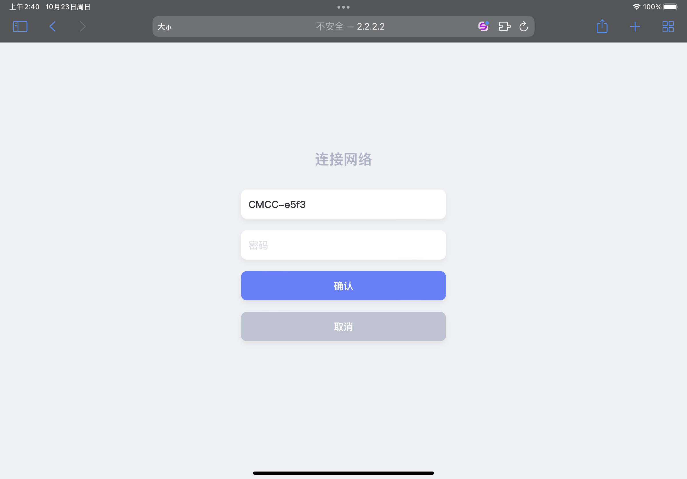

# **EasyWLAN**

简洁、美观、易用 - ESP8266 自助配网

## 预览

## 开发环境
操作系统：Windows 11

## 使用方法
### *新手*
1. 下载安装Arduino
2. 配置 【附加开发板管理器网址】 → "http://arduino.esp8266.com/stable/package_esp8266com_index.json"
3. 在Arduino中 【工具 → 开发板 → 开发板管理器中搜索 "ESP8266"】 并安装
4. 打开项目中的 EasyWLAN.ino 上传代码即可

### *老司机*
打开项目， 打开 EasyWLAN.ino 文件，上传代码

### *默认说明*
``热点名称：EasyWLAN``
``IP地址：2.2.2.2``
``默认打开DNS代理``

## 其他
* 基于 Arduino IDE 开发
* 遵循 Apache-2.0 开源协议